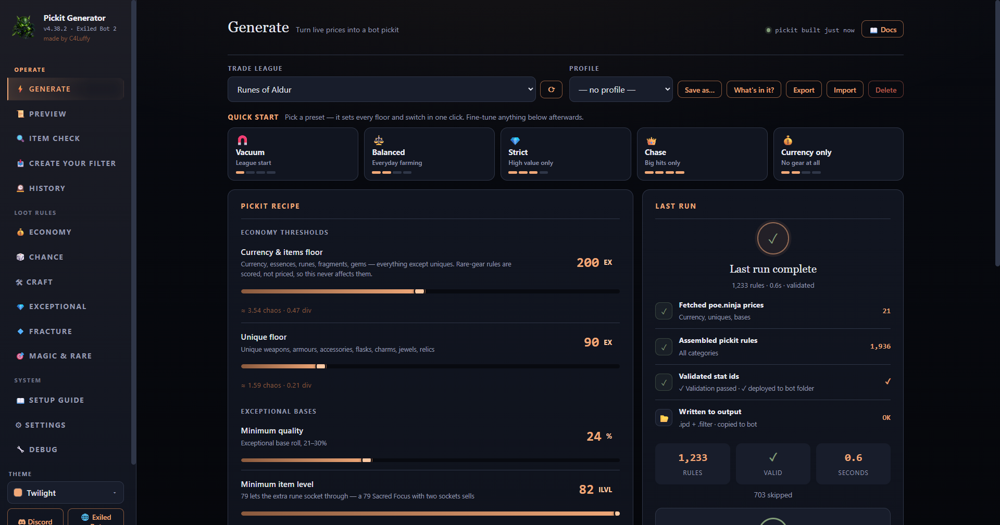

<p align="center">
  
</p>

<h1 align="center">ExileBot 2 Pickit Generator</h1>

<p align="center">
  <strong>Build a pickit you can understand.</strong><br>
  Turn live Path of Exile 2 prices into a validated Exiled Bot 2 pickit—or translate an existing <code>.ipd</code> into an in-game loot filter with every unavoidable difference reported.
</p>

<p align="center">
  <a href="https://github.com/c4Luffy/poe2-pickit-generator/releases/download/v4.39.3/ExileBot2PickitGenerator.exe"></a>
  <a href="https://github.com/c4Luffy/poe2-pickit-generator/releases"></a>
</p>

<p align="center">
  Portable <code>.exe</code> · No installer · No Python · No game-account access
</p>

<p align="center">
  <a href="https://c4luffy.github.io/poe2-pickit-generator/">Website</a> ·
  <a href="https://github.com/c4Luffy/poe2-pickit-generator/releases/tag/v4.39.3">Release notes</a> ·
  <a href="CHANGELOG.md">Changelog</a> ·
  <a href="https://discord.gg/T7DU3Afve6">Discord</a> ·
  <a href="https://github.com/c4Luffy/poe2-pickit-generator/issues">Issues</a>
</p>



<p align="center"><sub>Real running-app capture · Generate · captured on v4.38.2</sub></p>

> [!IMPORTANT]
> **Using v4.20.0 or v4.21.0? Update manually once.** Close the old app, [download v4.39.3](https://github.com/c4Luffy/poe2-pickit-generator/releases/download/v4.39.3/ExileBot2PickitGenerator.exe), and open it. Your settings, profiles, and Exiled Bot folder stay in place. Later in-app updates work normally.

## Start here

There are two simple ways to use the app.

### I need a pickit

Choose your league and a loot preset, adjust the price floors you want, then select **Generate**. The app fetches current poe.ninja prices, writes and validates the `.ipd`, and checks that Exiled Bot 2 is reading the same profile.

**Choose a league → Pick a preset → Set your floors → Generate**

### I already have a pickit

Drop any Exiled Bot `.ipd` into the window—a hand-made file, a friend's pickit, or one created by another tool. The app reads it, explains what the game can represent, and saves a translated Path of Exile 2 loot filter.

**Drop the `.ipd` → Review the report → Save the `.filter`**

## Generate in four steps

1. **Pick your league.** Fetch current Path of Exile 2 prices from poe.ninja.
2. **Choose a preset.** Start with Vacuum, Balanced, Strict, Chase, or Currency only.
3. **Set your floors.** Adjust what is worth stopping for, or use Auto-floor.
4. **Generate and check.** Write the files, validate thousands of rules, and confirm the active profile.

## Create your filter

**Create your filter** reads any Exiled Bot pickit and translates its rules into an in-game loot filter. When Path of Exile's filter language cannot represent a bot-only condition, the conversion report says exactly what happened.

- **Converted:** represented directly in the game filter.
- **Shown wider:** a bot-only check was removed, so the item remains visible.
- **Untranslatable:** listed with its source line and the reason.

Your source `.ipd` is **read-only**, is never modified, and is never uploaded. If it changes after the filter was created, the app warns you.

> [!WARNING]
> **Hide everything else starts ON.** Gold is never hidden. Turn this setting **OFF while botting** because hidden ground labels can stall pickup. Always review any translation warning before relying on Hide everything else.

## Item Check

Hover an item in Path of Exile 2, press `Ctrl+C`, then paste it into **Item Check**.

You receive one of three verdicts:

- **Picked up**
- **Ignored**
- **Depends on the rolls**

Each verdict includes the deciding rule and a practical next step.

> [!NOTE]
> **The verdict is not a simulation.** Item Check runs the same generator that writes the `.ipd` and shows the actual emitted line. With the same current settings, Item Check and the generated pickit cannot disagree.

Rare gear stays honest. If no recipe covers the base or its slot is disabled, the answer is a definitive no. When a recipe does cover it, Item Check shows the scored stats and threshold because the final roll check happens inside Exiled Bot. Fractured items show the actual target mods.

## Know which file does what

| Output | Used by | What it controls | Important note |
| --- | --- | --- | --- |
| `.ipd` pickit | Exiled Bot 2 | Which items the generated pickit targets | `pickit.ini` must point to the generated filename |
| `.filter` loot filter | Path of Exile 2 | Which ground labels are visible and how they look | Select it again under **Options → Game → Filters** after every save or regeneration |
| On-screen conversion report | You | What converted, was shown wider, or could not translate | It is a report, not a third output file |

<details>
<summary><strong>See a generated rule sample</strong></summary>

```text
// PoE 2 pickit — generated from live poe.ninja prices
[Type] == "Divine Orb" # [StashItem] == "true"
[Type] == "Stellar Amulet" && [Rarity] == "Normal" && [ItemLevel] >= "82" # [StashItem] == "true"
[Type] == "Heavy Belt" && [Rarity] == "Unique" # [UniqueName] == "Headhunter" && [StashItem] == "true"
[Category] == "Waystone" && [WaystoneTier] >= "10" # [StashItem] == "true"
```

</details>

## Safe, local, and recoverable

- Imported pickits are never modified or uploaded.
- Generated output stays on your PC.
- Rotating backups protect output before replacement.
- Hand-made ANSI pickits decode correctly.
- Unusual item-name characters are excluded and reported instead of disappearing silently.
- The app never asks for your Path of Exile account.

Windows SmartScreen may ask for confirmation because this free community executable is not code-signed. You can verify the release with its [published SHA-256 checksum](https://github.com/c4Luffy/poe2-pickit-generator/releases/download/v4.39.3/SHA256SUMS.txt).

### Three important usage notes

1. **Check `active_profile`.** A mismatch can make Exiled Bot 2 read an older pickit. The connection check verifies it.
2. **Reselect the optional game filter after every save or regeneration.** Choose it again under **Options → Game → Filters**. Exiled Bot reads the `.ipd`, not the `.filter`.
3. **Turn Hide everything else off while botting.** Hidden ground labels can stall pickup.

## Current release: v4.39.3

### Implicits finished, and five that showed the wrong number

- **27 bases showed a blank line** where the game gives them a real implicit — 52 entries became 79. Several change how you use the item: **Corona Amulet** grants a *helmet* socket, **Grasping Ring** a *glove* socket, **Stalking Belt** a *boot* socket, and **Grasping Mail** can also roll ring modifiers.
- **Five implicits displayed the wrong number.** Grand Spear read "+25 Weapon range" when the game stat is a percentage — +25%, not a flat 25. Same for Striking Quarterstaff, Flexed Crossbow, Utility Belt and Warlord Cuirass. Thane Mail showed a reduction as if it were a bonus.
- **Two-Stone Ring is three different bases** (fire+cold, fire+lightning, cold+lightning) and one roll was shown for all three.

### v4.39.2 — The bot can buy the Ritual fragment from a Ritual

- **An Audience with the King no longer carries `[IgnoreRitual]`.** That flag tells the bot not to spend tribute buying an item back from a Ritual altar — but this item *is* the Ritual pinnacle fragment, so a Ritual reward window is exactly where you'd want it. Expedition Logbook and Kulemak's Invitation keep the flag: the Logbook is a real ground drop, so not re-buying a copy is a genuine saving, and the Invitation is Abyss content where the flag never applies.

### v4.39.1 — First run picks up everything, and four bases corrected

- **First run now picks up everything.** The floors were already 0, but the two exceptional gates defaulted to quality 25 / item level 82 — so a new user's first pickit quietly skipped exceptional bases while the screen said "Picking up everything". They now open to 21 / 79. Anyone already running keeps their own settings.
- **Permafrost Staff and Reflecting Staff removed** — both exist only as uniques (The Whispering Ice, Atziri's Rule), so every white/rare rule naming them was dead. **Shrine Sceptre stays**: it was caught by the same sweep and that was wrong — it drops normally.
- **Crafting on staves never worked** — the only staff in the craft list couldn't drop as a Normal base. Ravenous Staff replaces it, and the rare staff slot is back to three bases.

### v4.39.0 — The second half of the audit — nine more bugs

- **A broken `game_data.json` can no longer strip your base rules.** That file self-updates from GitHub, and a truncated copy passed validation and silently deleted 16 of 17 base categories. A remote copy may now add bases, never delete a category.
- **Top movers can finally show uniques.** Every unique was being skipped, so all 7 unique categories recorded zero prices — a full league now records 438.
- **Backups stop touching other profiles**, **a shared profile can no longer break your app**, and **"Saved" now means saved** instead of a green toast over a failed write.
- **The Economy tab can no longer hang forever**, auto floor redraws its sliders, and **Ctrl+1…0 match the sidebar again** (Ctrl+4 was opening History; Magic & Rare loses the binding it only had by mistake).

### v4.38.4 — Six bugs found by a full audit of the app

Five parallel audits covered the rule engine, the bridge and config, the UI, the game data and the filter writers. Every fix was reproduced before and verified after, against live poe.ninja data.

- **The bot no longer spends Ritual tribute on Special Items.** When poe.ninja prices one of the three, the economy section emitted it *without* `[IgnoreRitual]` — the one flag those three exist to carry.
- **The `.filter` written beside your pickit keeps its item-level gates.** All 262 were dropped, so 68 base types showed from act 1 onward and that filter disagreed with the one Create your filter builds from the same pickit. Now: 0 disagreements across 1,123 names.
- **"Turn everything on" twice no longer destroys the undo** — the second click used to overwrite the snapshot, so restoring gave you all-on with your floors gone.
- **The item report no longer lists uniques the pickit doesn't contain** (440 claimed vs 227 real).
- **A hand-edited or ANSI `.ipd` no longer breaks generating forever**, and **a bad saved window size no longer stops the app from opening.**

### v4.38.3 — A unique on an anvil-only base no longer makes a dead rule

- **Uniques priced on a Runeforged/Runemastered base are skipped instead of rewritten.** Those bases are made at the anvil and never drop, so the generator used to strip the prefix and target the plain base — but the plain base doesn't always exist. The Prisoner's Manacles was targeted on `Verisium Cuffs`, a base the game has never had, so the rule could never fire and it failed validation. Rathpith Globe, Voll's Protector and The Prisoner's Manacles each keep a rule on the base that really drops.

### v4.38.2 — An update announcement that actually says something

- **"What's new" no longer shows a bare link and nothing else.** A release published before its notes are attached gets an auto-generated body containing one `Full Changelog` URL, and the dialog showed that instead of the highlights bundled in the exe. A stashed body with no prose in it now loses to those highlights.

### v4.38.1 — Exceptional tab uses its full width

- **Shields and Foci no longer render into a third of the page.** Every category in the Exceptional tab was pinned to three equal columns so Str | Dex | Int would line up — but Shields only has Str bases and Foci only Int, so one filled column sat beside two empty ones. Each category now gets as many columns as it actually has.

### v4.38.0 — "Everything on" means everything, plus a tab-by-tab cleanup

Every tab was audited that cycle. The headline items are behaviour fixes — things that were quietly answering wrong:

- **🔓 Turn everything on now really does.** It flipped every switch, but Adaptive market floors then recomputed a high floor on the next run and threw most of it away. It now also drops both floors to 0, switches Adaptive floors off, and opens exceptional gates to quality 21 / ilvl 79. **Put my switches back** restores all of it.
- **A floor you set by hand sticks** — typing or dragging one now switches Adaptive floors off instead of silently recomputing over your number.
- **Item Check stopped rejecting quality white bases.** It now strips the `Superior` prefix and resolves Magic items whose base is wrapped in affixes, so the bases your generated rules cover are recognized correctly.
- **Create your filter translates `ItemLevel` and `WaystoneTier` exactly** instead of dropping them, so far fewer rules count as "shown wider" and Hide mode is safer.
- **Useful detail across every tab:** bases display their game-data implicits when they have one; Chance cards show live target prices and art; profile imports preview everything they turn OFF; Preview explains and compares rules; Economy shows Top movers.

[Read the complete v4.39.3 release notes](https://github.com/c4Luffy/poe2-pickit-generator/releases/tag/v4.39.3) · [full changelog](CHANGELOG.md)

<details>
<summary><strong>Everything included</strong></summary>

- Five presets: Vacuum, Balanced, Strict, Chase, and Currency only.
- Editable exalted-orb floors and Auto-floor.
- Current-league pricing and seven-day unique trends.
- Item Check with the actual emitted rule.
- Coverage for 17 rare-gear slots.
- Pickit-to-filter conversion with an honest report.
- Setup guide and connection check.
- Rotating backups and restore tools.
- Portable Windows application with no installer.

</details>

<details>
<summary><strong>Build from source</strong></summary>

Requirements: Windows 10 or 11 and Python 3.10 or newer.

```powershell
git clone https://github.com/c4Luffy/poe2-pickit-generator.git
cd poe2-pickit-generator
python -m venv .venv
.venv\Scripts\Activate.ps1
python -m pip install -e .
python -m exilebot_pickit
```

</details>

## Help and community

- [Setup and troubleshooting](https://c4luffy.github.io/poe2-pickit-generator/#faq)
- [Discord community](https://discord.gg/T7DU3Afve6)
- [Report an issue](https://github.com/c4Luffy/poe2-pickit-generator/issues)
- [All releases](https://github.com/c4Luffy/poe2-pickit-generator/releases)

---

MIT licensed. Community project; not affiliated with Grinding Gear Games, Path of Exile 2, Exiled Bot 2, or poe.ninja.
