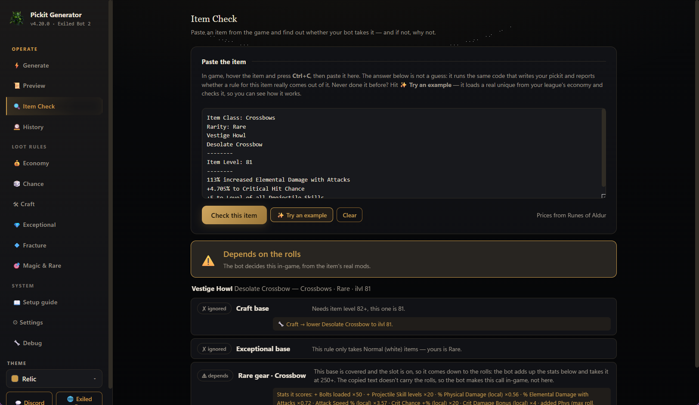

# PoE 2 Pickit Generator

### for Exiled Bot 2

**Live PoE2 prices in. A validated, bot-ready pickit out.**

Choose your league and how greedy the bot should be. The app turns today's
[poe.ninja](https://poe.ninja) economy into a complete pickit, validates it,
deploys it, and confirms Exiled Bot 2 is listening to the same profile.

 

> [!IMPORTANT]
> **Using v4.20.0 or v4.21.0? Update manually once.** The updater in those two
> releases is broken and may show an error or reopen the old app. Close
> it, **[download v4.29.2](https://github.com/c4Luffy/poe2-pickit-generator/releases/download/v4.29.2/ExileBot2PickitGenerator.exe)**,
> then open the new file. Your settings, profiles, and Exiled Bot folder stay
> unchanged. Future in-app updates will work normally.

 

Real running-app capture · Item Check in an earlier release

## What it does

| Live market intelligence | Explainable, validated rules | Reliable bot handoff |
|---|---|---|
| Reads current league prices instead of shipping a frozen price list. | Checks stat IDs before deploy; Item Check then applies those same generated rules to the item copied in game. | The first-run wizard finds the bot, copies the output, reads <code>pickit.ini</code>, and confirms the active profile. |
| Five presets plus editable floors and Auto-floor. | Reports Picked up, Ignored, or Depends on the rolls, with the deciding rule and an actionable explanation. | Offers one-click profile repair, rotating backups, and restore. |

The generated pickit covers currency, uniques, bases, runes, essences,
fragments, tablets, maps, waystones, rare gear, and more. An optional matching
in-game loot filter can be generated alongside it.

## Quick start

**[Download the v4.29.2 portable Windows app](https://github.com/c4Luffy/poe2-pickit-generator/releases/download/v4.29.2/ExileBot2PickitGenerator.exe)**
and open it. Before your first Generate, the four-step wizard appears
automatically:

1. **Welcome:** choose the trade league you are farming.
2. **Your bot:** verify the Exiled Bot folder the app usually finds for you. If
   the active pickit points elsewhere, choose **Fix it for me**.
3. **How much loot?:** **Balanced** is already selected. Vacuum, Strict, Chase,
   and Currency only are one tap away; each preset sets its floors and switches.
4. **Generate now:** fetch live prices, build and validate the pickit, and copy
   it to the bot when connected.

It only opens automatically if you have never generated. Existing users can
open **Setup guide → Walk me through it** at any time without resetting
anything.

Need to explain a specific drop? Hover it in game, press **Ctrl+C**, then open
**Item Check**. The item is normally pasted and checked automatically—no
**Ctrl+V** and no extra button. If clipboard access is blocked, paste it and
choose **Check this item**.

> [!NOTE]
> Exiled Bot only loads the <code>.ipd</code> named by <code>active_profile</code>.
> A copied file can exist while the bot keeps reading an older profile. The
> connection check catches that silent mismatch.

> [!NOTE]
> After every Generate, reselect the optional in-game filter under
> **Options → Game → Filters**. PoE 2 only reads it when selected. Exiled Bot
> users can ignore this step because the bot reads the <code>.ipd</code> directly.

## Built for real runs

- **Live poe.ninja pricing** across the current trade league.
- **Four-step first-run wizard** for the league, bot connection, loot amount,
  and the first Generate.
- **Automatic Item Check:** copy an item in game and open the tab for an
  immediate verdict from the emitted rule, with a jump to that rule in Preview.
- **7-day Economy sparklines** on every unique, showing whether its market
  price is climbing or falling.
- **Exceptional item-level 79 support** for valuable two-socket bases such as
  Sacred Focus.
- **Five quick-start presets:** Vacuum, Balanced, Strict, Chase, and Currency only.
- **27,000-mod validation** before rules reach the bot.
- **Rare-gear scoring** with weighted recipes for all 17 equipment slots.
- **Search across rule tabs:** Chance, Exceptional, and Fracture each have a
  search box; Fracture also searches target mod text. Preview can copy one
  section at a time.
- **What’s New panel** on first launch after an update, available again from the
  version label.
- **Changed filter and run history** so market-driven differences are visible.
- **Best-effort bot-folder detection** with manual selection when needed.
- **Backups before replacement** with restore support.
- **Nine colour themes** sharing one consistent typography system and readable
  uppercase tabs.
- **No tray integration:** one predictable window and a smaller package.
- **Multi-unit pricing** that reads exalt, divine, and chaos values.
- **Portable single-file app:** no installer and no Python required.

## Latest release: [v4.29.2](https://github.com/c4Luffy/poe2-pickit-generator/releases/tag/v4.29.2)

### Guided first run, safer presets, faster answers

v4.29 adds the four-step setup wizard and makes **Balanced** the clear default
for new users. v4.29.2 also fixes an important floor-conversion bug: presets
shown in Chaos or Divine could become roughly **58× or 425× stricter** than
intended. The generator now converts into the displayed unit and safely keeps
small values that would otherwise round away.

- Item Check normally auto-pastes and auto-checks the item copied with **Ctrl+C**.
- Economy shows seven-day price trends.
- Exceptional rules cover item-level 79 two-socket targets.
- Search now covers Chance, Exceptional, and Fracture; Fracture also matches
  target mod text.
- Copy buttons are reliable, the selected league stays saved, and numbers
  render consistently.

> [!IMPORTANT]
> **Item Check is not a simulation.** It uses the same pickit-generation code
> that writes the <code>.ipd</code> file and shows the exact line emitted for the
> pasted item. For the same current settings, the tab and the generated file
> cannot disagree.

**[Read the full changelog →](CHANGELOG.md)**

## Download safety

This is a free community tool. Windows SmartScreen may ask for confirmation
because the executable is not code-signed.

- The complete source and release workflow are public.
- Every release includes a
  **[SHA-256 checksum](https://github.com/c4Luffy/poe2-pickit-generator/releases/download/v4.29.2/SHA256SUMS.txt)**.
- The app reads public price data from poe.ninja and update data from GitHub.
- It never asks for your Path of Exile account.

## Build from source

<b>Developer setup and checks</b>

 

<pre><code>python -m pip install -e .
python -m exilebot_pickit</code></pre>

<pre><code>python -m pip install pytest ruff
python -m pytest -q
ruff check .</code></pre>

The application code lives in <code>src/exilebot_pickit/</code>. Push a
<code>vX.Y.Z</code> tag and the release workflow builds the Windows executable
and publishes its checksum.

## Help and community

- **[Website](https://c4luffy.github.io/poe2-pickit-generator/)** — complete
  product tour, setup flow, and FAQ.
- **[Discord](https://discord.gg/T7DU3Afve6)** — community help.
- **[Issues](https://github.com/c4Luffy/poe2-pickit-generator/issues)** — bugs
  and feature requests.
- **[Releases](https://github.com/c4Luffy/poe2-pickit-generator/releases)** —
  downloads and version history.

---

MIT licensed · built for the Exiled Bot 2 community · prices by
[poe.ninja](https://poe.ninja)

Not affiliated with Grinding Gear Games or Exiled Bot.

