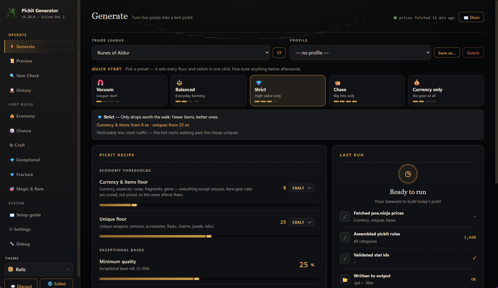

<p align="center">
  
</p>

<h1 align="center">ExileBot 2 Pickit Generator</h1>

<p align="center">
  <strong>Build a pickit you can understand.</strong><br>
  Turn live Path of Exile 2 prices into a validated Exiled Bot 2 pickit—or translate an existing <code>.ipd</code> into an in-game loot filter with every unavoidable difference reported.
</p>

<p align="center">
  <a href="https://github.com/c4Luffy/poe2-pickit-generator/releases/download/v4.36.0/ExileBot2PickitGenerator.exe"></a>
</p>

<p align="center">
  Portable <code>.exe</code> · No installer · No Python · No game-account access
</p>

<p align="center">
  <a href="https://c4luffy.github.io/poe2-pickit-generator/">Website</a> ·
  <a href="https://github.com/c4Luffy/poe2-pickit-generator/releases/tag/v4.36.0">Release notes</a> ·
  <a href="CHANGELOG.md">Changelog</a> ·
  <a href="https://discord.gg/T7DU3Afve6">Discord</a> ·
  <a href="https://github.com/c4Luffy/poe2-pickit-generator/issues">Issues</a>
</p>



<p align="center"><sub>Real running-app capture · Generate · current v4.36.0 release</sub></p>

> [!IMPORTANT]
> **Using v4.20.0 or v4.21.0? Update manually once.** Close the old app, [download v4.36.0](https://github.com/c4Luffy/poe2-pickit-generator/releases/download/v4.36.0/ExileBot2PickitGenerator.exe), and open it. Your settings, profiles, and Exiled Bot folder stay in place. Later in-app updates work normally.

## Start here

There are two simple ways to use the app.

### I need a pickit

Choose your league and a loot preset, adjust the price floors you want, then select **Generate**. The app fetches current poe.ninja prices, writes and validates the `.ipd`, and checks that Exiled Bot 2 is reading the same profile.

**Choose a league → Pick a preset → Set your floors → Generate**

### I already have a pickit

Drop any Exiled Bot `.ipd` into the window—a hand-made file, a friend's pickit, or one created by another tool. The app reads it, explains what the game can represent, and saves a translated Path of Exile 2 loot filter.

**Drop the `.ipd` → Review the report → Save the `.filter`**

## Generate in four steps

1. **Pick your league.** Fetch current Path of Exile 2 prices from poe.ninja.
2. **Choose a preset.** Start with Vacuum, Balanced, Strict, Chase, or Currency only.
3. **Set your floors.** Adjust what is worth stopping for, or use Auto-floor.
4. **Generate and check.** Write the files, validate thousands of rules, and confirm the active profile.

## Create your filter

**Create your filter** reads any Exiled Bot pickit and translates its rules into an in-game loot filter. When Path of Exile's filter language cannot represent a bot-only condition, the conversion report says exactly what happened.

- **Converted:** represented directly in the game filter.
- **Shown wider:** a bot-only check was removed, so the item remains visible.
- **Untranslatable:** listed with its source line and the reason.

Your source `.ipd` is **read-only**, is never modified, and is never uploaded. If it changes after the filter was created, the app warns you.

> [!WARNING]
> **Hide everything else starts ON.** Gold is never hidden. Turn this setting **OFF while botting** because hidden ground labels can stall pickup. Always review any translation warning before relying on Hide everything else.

## Item Check

Hover an item in Path of Exile 2, press `Ctrl+C`, then paste it into **Item Check**.

You receive one of three verdicts:

- **Picked up**
- **Ignored**
- **Depends on the rolls**

Each verdict includes the deciding rule and a practical next step.

> [!NOTE]
> **The verdict is not a simulation.** Item Check runs the same generator that writes the `.ipd` and shows the actual emitted line. With the same current settings, Item Check and the generated pickit cannot disagree.

Rare gear stays honest. If no recipe covers the base or its slot is disabled, the answer is a definitive no. When a recipe does cover it, Item Check shows the scored stats and threshold because the final roll check happens inside Exiled Bot. Fractured items show the actual target mods.

## Know which file does what

| Output | Used by | What it controls | Important note |
| --- | --- | --- | --- |
| `.ipd` pickit | Exiled Bot 2 | Which items the generated pickit targets | `pickit.ini` must point to the generated filename |
| `.filter` loot filter | Path of Exile 2 | Which ground labels are visible and how they look | Select it again under **Options → Game → Filters** after every save or regeneration |
| On-screen conversion report | You | What converted, was shown wider, or could not translate | It is a report, not a third output file |

<details>
<summary><strong>See a generated rule sample</strong></summary>

```text
// PoE 2 pickit — generated from live poe.ninja prices
[Type] == "Divine Orb" # [StashItem] == "true"
[Type] == "Stellar Amulet" && [Rarity] == "Normal" && [ItemLevel] >= "82" # [StashItem] == "true"
[Type] == "Heavy Belt" && [Rarity] == "Unique" # [UniqueName] == "Headhunter" && [StashItem] == "true"
[Category] == "Waystone" && [WaystoneTier] >= "10" # [StashItem] == "true"
```

</details>

## Safe, local, and recoverable

- Imported pickits are never modified or uploaded.
- Generated output stays on your PC.
- Rotating backups protect output before replacement.
- Hand-made ANSI pickits decode correctly.
- Unusual item-name characters are excluded and reported instead of disappearing silently.
- The app never asks for your Path of Exile account.

Windows SmartScreen may ask for confirmation because this free community executable is not code-signed. You can verify the release with its [published SHA-256 checksum](https://github.com/c4Luffy/poe2-pickit-generator/releases/download/v4.36.0/SHA256SUMS.txt).

### Three important usage notes

1. **Check `active_profile`.** A mismatch can make Exiled Bot 2 read an older pickit. The connection check verifies it.
2. **Reselect the optional game filter after every save or regeneration.** Choose it again under **Options → Game → Filters**. Exiled Bot reads the `.ipd`, not the `.filter`.
3. **Turn Hide everything else off while botting.** Hidden ground labels can stall pickup.

## Current release: v4.36.0

### Label themes — NeverSink's colors on every filter the app writes

Pick a **label theme** once and both filters the app writes wear it: the one generated next to every pickit and the one converted from any pickit. A live preview shows how the labels will look on the ground before you commit.

- **Community classic** (default): colors, sizes and minimap icons taken verbatim from NeverSink's live PoE2 filter — plus Minimal, High contrast, and a Colorblind-safe blue/orange theme.
- **Jackpot tier:** drops worth 50+ exalted at generate time (and always Mirror of Kalandra / Divine Orb) get the red screamer, sound and beam. Only that tier makes noise — cheap drops stay quiet.
- **Chance Bases** now show the unique you're chancing for with real game art, and the list is curated down to four bases.
- **Prices auto-refresh** every 15 minutes; Economy names wrap instead of truncating; the run log is resizable and wraps paths cleanly.
- **v4.35.x:** Create your filter (any `.ipd` → in-game filter with an honest report), drag & drop, same-day hardening audit.

[Read the complete v4.36.0 release notes](https://github.com/c4Luffy/poe2-pickit-generator/releases/tag/v4.36.0)

<details>
<summary><strong>Everything included</strong></summary>

- Five presets: Vacuum, Balanced, Strict, Chase, and Currency only.
- Editable exalted-orb floors and Auto-floor.
- Current-league pricing and seven-day unique trends.
- Item Check with the actual emitted rule.
- Coverage for 17 rare-gear slots.
- Pickit-to-filter conversion with an honest report.
- Setup guide and connection check.
- Rotating backups and restore tools.
- Portable Windows application with no installer.

</details>

<details>
<summary><strong>Build from source</strong></summary>

Requirements: Windows 10 or 11 and Python 3.10 or newer.

```powershell
git clone https://github.com/c4Luffy/poe2-pickit-generator.git
cd poe2-pickit-generator
python -m venv .venv
.venv\Scripts\Activate.ps1
python -m pip install -e .
python -m exilebot_pickit
```

</details>

## Help and community

- [Setup and troubleshooting](https://c4luffy.github.io/poe2-pickit-generator/#faq)
- [Discord community](https://discord.gg/T7DU3Afve6)
- [Report an issue](https://github.com/c4Luffy/poe2-pickit-generator/issues)
- [All releases](https://github.com/c4Luffy/poe2-pickit-generator/releases)

---

MIT licensed. Community project; not affiliated with Grinding Gear Games, Path of Exile 2, Exiled Bot 2, or poe.ninja.
