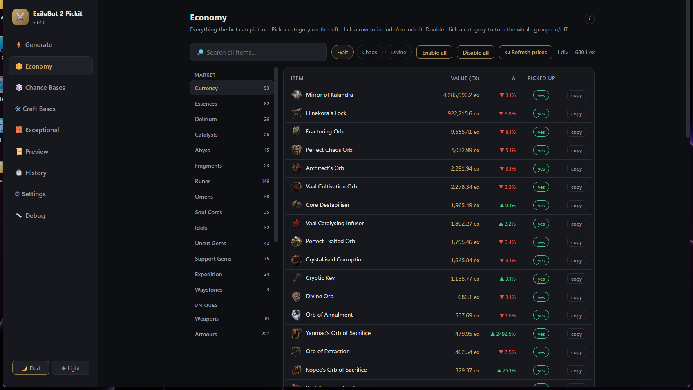

<div align="center">

<br>

# ⚔️ ExileBot 2 Pickit Generator

**The market moves. Your pickit follows.**

Turns live [poe.ninja](https://poe.ninja) prices into a complete Exiled Bot 2 pickit —
so your bot grabs what sells *today*, not what sold last month.

<br>

[](https://github.com/c4Luffy/poe2-pickit-generator/actions/workflows/ci.yml)
[](https://github.com/c4Luffy/poe2-pickit-generator/releases/latest)
[](https://github.com/c4Luffy/poe2-pickit-generator/releases)
[](https://github.com/c4Luffy/poe2-pickit-generator/releases/latest)
[](#-license)

<br>

<a href="https://github.com/c4Luffy/poe2-pickit-generator/releases/latest"></a>

*One .exe — no Python, no installer, no setup.*

<br><br>



<br><br>

&nbsp;
&nbsp;
&nbsp;


</div>

<br>

<div align="center">

### 🌐 poe.ninja prices &nbsp;→&nbsp; ⚔️ your floors & choices &nbsp;→&nbsp; 📄 `.ipd` pickit &nbsp;→&nbsp; 🤖 your bot

</div>

> [!TIP]
> **First time?** Download → pick your league → press **⚡ Generate** → point the bot at the `.ipd`.
> Everything valuable is picked by default; the **Economy** tab is where you say *"not that"* with one click.

---

## What you get

### 🪙 Prices that are never stale
Every generate pulls the **real economy of your league** — currency, essences, runes, catalysts, uniques, gems and more. Set your value floor in **Exalt, Chaos or Divine**, or press **✨ Auto floor** and let the league's actual prices choose it for you.

### 🛡️ A bot that can't be fed garbage
The **safety net** blocks auto-deploy if a run ever produces a collapsed or broken pickit. Backups rotate on every generate. Rules are validated before they ever reach your bot folder.

### 🧱 The stuff other pickits forget
Tablets, splinters, wombgifts, boss keys, **exceptional bases with extra rune sockets**, chance-orb targets (Headhunter, Mageblood…), craftable high-ilvl bases, exotic drop-only bases — all built in, all individually toggleable, all explained in plain language inside the app.

### 🔄 It updates itself
Game patch added new items? The app's **game data refreshes from this repo automatically** — every installed copy, within hours, no new download. Item names are verified against the live game (poe2db + NeverSink's filter data), so dead rules don't rot in your pickit.

### ⏰ Zero-click operation
**Auto-Regenerate** every few hours + **tray mode** + **auto-copy to the bot folder**: start it once, minimize it, and your bot rides fresh prices all day.

> [!NOTE]
> The app also writes a matching **in-game `.filter`** for manual play sessions — but don't feed that one to the bot: hidden drops can make Exiled Bot stall. The `.ipd` is the bot's file.

---

## The app in 30 seconds

| Tab | One-liner |
|-----|-----------|
| ⚡ **Generate** | The button. League, floors, ✨ auto floor from live prices. |
| 🪙 **Economy** | Every pickable item with live prices & trend arrows — click to exclude. |
| 🎲 **Chance Bases** | White bases worth chancing into Headhunter, Mageblood & co. |
| 🛠 **Craft Bases** | Blank ilvl-82 bases worth keeping as crafting canvases. |
| 🧱 **Exceptional** | Extra-socket bases: white pickups + any unique that drops on one. |
| 📜 **Preview** | The exact file the bot reads — sections, filters, validation marks. |
| 🕘 **History** | Every run charted, so you see your pickit evolve over the league. |
| ⚙ **Settings** | Bot folder, auto-copy, auto-regen, tray, backups, updates. |
| 🔧 **Debug** | API test, cache tools, logs — for the one day something's weird. |

<details>
<summary>&nbsp;💡 <b>Power-user tips</b></summary>

<br>

- **Right-click any item row** → its pickit rule goes to your clipboard
- **Double-click a category chip** → whole category on/off
- <kbd>Ctrl</kbd>+<kbd>G</kbd> generates, <kbd>Ctrl</kbd>+<kbd>R</kbd> refreshes leagues
- **▲▼ arrows** = price moved >3% · post-generate alerts flag >20% swings
- Every tab has an **ℹ "what is this?"** explainer — click it, no wiki needed

</details>

<details>
<summary>&nbsp;🛠️ <b>Troubleshooting</b></summary>

<br>

| Symptom | Fix |
|---------|-----|
| No prices loading | Debug tab → **Run API test**. poe.ninja down? The app uses its price cache. |
| Bot ignores items | Check the pickit path in Exiled Bot 2, or enable **Auto-copy** in Settings. |
| Windows blocks the exe | **More info → Run anyway** — unsigned free tool, full source is right here. |
| Where are my files? | `ExileBot2PickitGenerator_data` folder next to the `.exe`. |

</details>

<details>
<summary>&nbsp;👩‍💻 <b>Build from source</b></summary>

<br>

```bash
pip install -e .            # run:   python -m exilebot_pickit
pip install pytest ruff     # test:  python -m pytest -q && ruff check .
```

`src/exilebot_pickit/` — `generator.py` + `generators/assembly.py` build the rules · `webui/` is the WebView2 app (`api.py` bridge + `app.html` UI) · `data/` holds remote-updatable game data · `ui/` config & updater. Push a `vX.Y.Z` tag and CI builds + publishes the exe.

</details>

---

## 📝 What's new

### v3.5.2 — latest

- 🎲 **Chance Bases rebuilt** to a focused 9-target list (Mageblood, Headhunter, Astramentis, Ryslatha's Coil, Fireflower, Ventor's, Thief's Torment, Eye of Chayula, Atziri's Acuity) — all confirmed droppable; old speculative list removed
- 🧹 Cleaned out the boss-drop tag code and orphaned styles tied to the old list

### v3.5.1

- 🐛 Polish pass from live testing: wider Chance/Craft cards (no more crushed names), number inputs never clip digits, chase-target tags wrap cleanly ("⚠ boss drop · chance unconfirmed")
- 🧱 Exceptional base list sorted by item level (highest first) inside each slot
- ✅ Updater verified end-to-end — downloads the release exe to your Downloads folder

### v3.5.0

- ⚡ **Generate page rebuilt** to the new design: numbered steps, an **Auto floor switch** (floors recompute from live prices on every generate), 7-day floor sparklines, timestamped colored run log, and a "Generated successfully" panel
- ⬇️ **Update downloader** — the sidebar status card checks GitHub and downloads the new exe straight to your Downloads folder (never touches the running install)
- 🎨 **Theme gallery** — Gold (default), Ocean, Nebula, Ember; light mode retired
- 🎲 **Chance Bases restored to the full list** — 6 verified targets + 11 chase targets clearly tagged "⚠ boss drop"; cards redesigned with icons and switches (Craft too, with −/+ level steppers)
- 🖱️ Select any lines in Preview and Ctrl+C copies exactly that · hover highlights everywhere · redundant Force-refresh removed · Debug output on top with per-button hints · config/log open falls back to Notepad

### v3.4.1

- 🐛 Fixed the app freezing on "Loading…" (Preview & Settings pages were lost in a layout rewrite)
- 🔧 Debug tab: compact one-screen layout with a hint under every button, output box always in view, clearer messages
- 📝 "Open config/log" now falls back to Notepad when Windows has no default editor
- 🎨 Themed scrollbars in both themes · startup errors now show on screen instead of failing silently

### v3.4.0

- 🪙 **Economy redesigned** — categories moved into a grouped sidebar (Market / Uniques / Always Pick), every group in its own place with real item icons everywhere (embedded — they work offline)
- 🖱️ **Everything is toggleable now** — unique items, waystone rarities, every always-pick group and item; duplicates between priced and always-pick lists resolved with force-keep above your floor
- 🧱 **Exceptional tab upgraded** — every base shows its icon + stats (level, Armour/Evasion/ES, weapon damage/crit/APS/DPS from poe2db) and can be excluded per base
- 🔎 **Smarter search** — "ring" finds rings, not "Fractu-ring-Orb"; searches base types too
- 🎨 **New light theme (Clean Studio)** + bigger UI, redesigned Generate/Settings/Debug pages, cleaner number inputs
- 🧰 Craft & Chance cards show icons and stats · Auto floor how-to hint + keep 10–100% range · league dropdown shows current leagues only · League-start button retired (Auto floor covers it)

### v3.3.0

- 🧱 **New Exceptional tab** — extra-socket bases managed in one place: white-base pickup (quality/ilvl gates) + optionally **any unique that drops on an exceptional base**, whatever its price
- 📋 **Always-Pick Items in Economy** — tablets, splinters, wombgifts, boss keys, jewels and exotic bases are now visible and individually toggleable
- 💎 **New pickup sections** — 48 exotic bases (Breach rings, Runic Fork…), valuable jewels (Rare ilvl 81+, Timeless Jewel, Time-Lost Diamond), Kulemak's Invitation
- 🔍 **Game-data audit** — names verified against the live game: 7 dead rune names out, 12 real ones in, chance list corrected to only actually-chanceable targets
- 🐛 Copy buttons always work (native clipboard) · Preview copies your selection · long rules wrap · validation marks hit the right lines · profiles remember the new settings · game filter folder auto-detected

<details>
<summary><b>Older releases</b></summary>

<br>

**v3.2.0**
- 🔄 **All game data updates without a new release** — tablets, splinters, wombgifts, always-pick lists, chance bases and name fixes live in the self-updating `game_data.json`; bad remote data is rejected, the app keeps its built-in copy

**v3.1.1**
- Rare Items tab pulled for a redesign — coming back rebuilt step by step


</details>

<!-- ON EACH UPDATE: new version under "What's new", move the previous latest into "Older releases", keep 5 total. -->

---

<div align="center">

**[⬇️ Download](https://github.com/c4Luffy/poe2-pickit-generator/releases/latest)** · **[🐛 Report an issue](https://github.com/c4Luffy/poe2-pickit-generator/issues)** · **License: MIT**

<sub>Built for the Exiled Bot 2 community. Prices by poe.ninja. Not affiliated with GGG.</sub>

</div>
