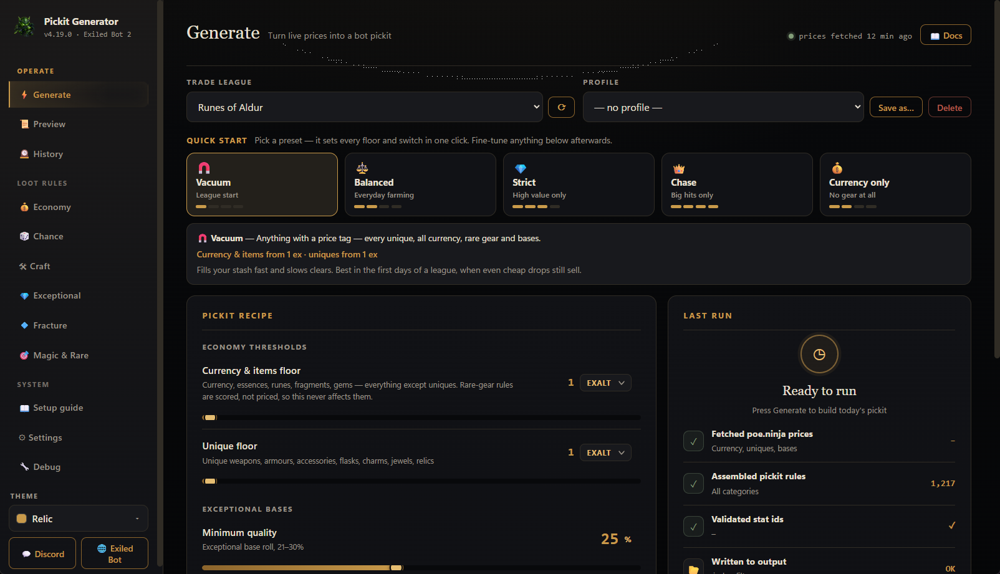

<div align="center">

# ⚔️ ExileBot 2 Pickit Generator

### Live [poe.ninja](https://poe.ninja) prices in → a complete, validated Exiled Bot 2 pickit out.
**Your bot grabs what sells *today* — 2,000+ rules rebuilt in seconds.**

[](https://github.com/c4Luffy/poe2-pickit-generator/releases/latest)
[](https://github.com/c4Luffy/poe2-pickit-generator/releases)
[](#license)

<br>

<a href="https://github.com/c4Luffy/poe2-pickit-generator/releases/latest">
</a>

<br><br>

## [⬇️ &nbsp;Download for Windows](https://github.com/c4Luffy/poe2-pickit-generator/releases/latest) &nbsp;·&nbsp; [🌐 Website](https://c4luffy.github.io/poe2-pickit-generator/)

**[💬 Discord](https://discord.gg/T7DU3Afve6)** · **[🤖 Exiled Bot](https://exiled-bot.net/)**

<sub>One `.exe` · no Python · no installer · updates itself</sub>

<br>

| 📈 **Live economy** | 🎯 **Smart pickup** | 🧠 **Validated** | 🕰️ **Set & forget** |
|:---:|:---:|:---:|:---:|
| Prices pulled fresh from poe.ninja every generate | Junk never leaves the ground — ilvl & tier filter *before* pickup | Every stat id checked against the bot's own dictionary | Regenerate any time the market moves — one click |

</div>

<br>

Everything — features, quick start and FAQ — lives on the
**[website](https://c4luffy.github.io/poe2-pickit-generator/)**. In short: pick your league,
press **⚡ Generate**, point Exiled Bot 2 at the `.ipd`. Live prices in, a complete pickit out.

> ### 💍 What's new in v4.11.4 — rings get fracture targets
> Rings were the last empty slot in the Fracture tab. Three new targets
> (**resistance**, **added attack damage**, **rarity**) across six bases picked
> for their implicits — including the four **modifier-count rings** that bias
> whether a ring carries prefixes or suffixes, which is exactly what you want
> when fracturing for one specific mod. Earlier in v4.11.2–v4.11.3: a new
> **game-data checker** caught four fracture rules that silently matched nothing.
>
> **[→ Full changelog](CHANGELOG.md)**

<details>
<summary><b>Build from source</b></summary>

<br>

```bash
pip install -e .            # run:   python -m exilebot_pickit
pip install pytest ruff     # test:  python -m pytest -q && ruff check .
```

`src/exilebot_pickit/` — `generator.py` builds the rules · `webui/` is the WebView2 app · `data/` holds remote-updatable game data. Push a `vX.Y.Z` tag and CI builds + publishes the exe.

</details>

<br>

---

<div align="center">
<a name="license"></a>

**[🌐 Website](https://c4luffy.github.io/poe2-pickit-generator/)** · **[⬇️ Download](https://github.com/c4Luffy/poe2-pickit-generator/releases/latest)** · **[💬 Discord](https://discord.gg/T7DU3Afve6)** · **[🐛 Issues](https://github.com/c4Luffy/poe2-pickit-generator/issues)** · MIT

<sub>Built for the Exiled Bot 2 community · prices by poe.ninja · not affiliated with GGG</sub>

</div>
